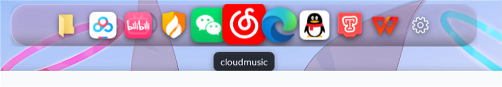
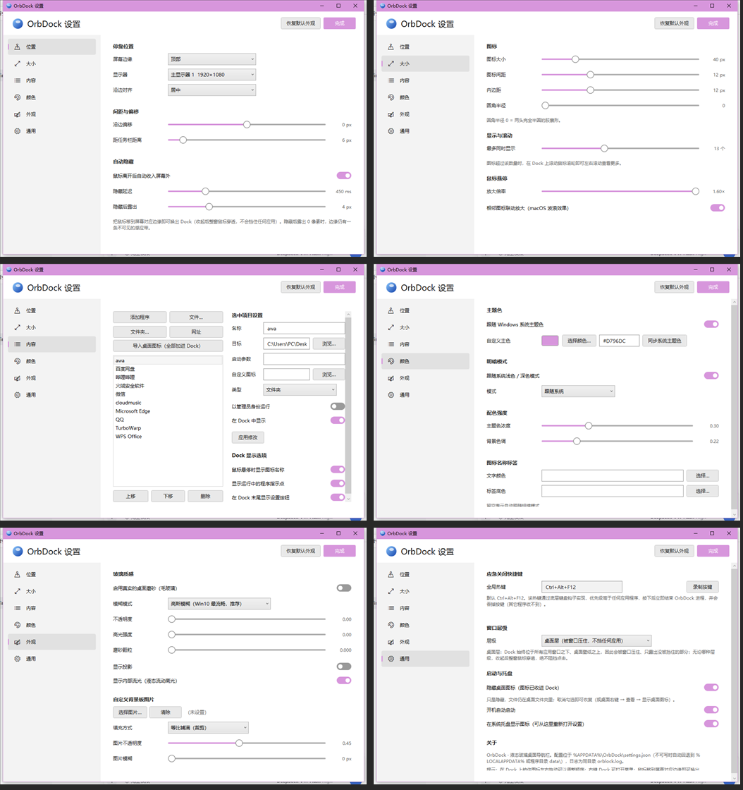
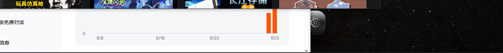
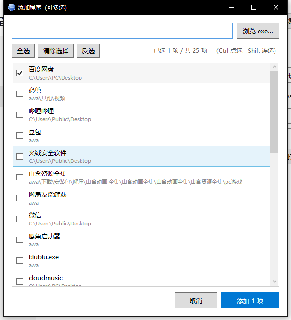

# OrbDock · 液态玻璃桌面导航栏

> Windows 10 / 11 上的第三方桌面 Dock：**真·桌面磨砂（毛玻璃）**、胶囊形、半透明、跟随系统主题色、
> 自动隐藏、悬停显示名称、滚轮横滚、可换背景板图片，**保留并避开 Windows 任务栏**。



---

## 目录

- [一、快速开始](#一快速开始)
- [二、操作](#二操作)
- [三、设置界面](#三设置界面win10-设置风格)
- [四、命令行开关](#四命令行开关)
- [五、配置文件](#五配置文件)
- [六、实现要点](#六实现要点技术说明)
- [七、从源码构建](#七从源码构建)
- [八、仓库结构](#八仓库结构)

---

## 一、快速开始

1. 双击 **`启动 OrbDock.cmd`**，或直接运行 **`app\OrbDock.exe`**。
2. 需要 **.NET 8 桌面运行时**（`Microsoft.WindowsDesktop.App 8.x`）。
   没装的话去 <https://dotnet.microsoft.com/download/dotnet/8.0> 下载 “.NET Desktop Runtime”。
3. 首次启动会在屏幕底部出现一条胶囊形 Dock，鼠标离开后自动收起；把鼠标移到屏幕对应边缘即可唤出。



### ⚠ 应急关闭快捷键：`Ctrl + Alt + F12`

这是**最高优先级**的全局热键：通过底层键盘钩子（`WH_KEYBOARD_LL`）在任何程序之前截获并**吞掉**该按键，
按下后 OrbDock **立即结束进程**。当 Dock 挡路、设置窗口打不开、托盘图标被隐藏时，用它一定能关掉。

> 该组合键会被 OrbDock 独占（其它程序收不到），所以在「通用」页录制新热键时不要再按它。

---

## 二、操作

| 操作 | 效果 |
| --- | --- |
| 鼠标移到屏幕边缘（Dock 收起时） | 唤出 Dock（收起后整窗鼠标穿透，不会挡住任何应用） |
| 鼠标离开 Dock | 按设定的延迟自动收起（可关闭自动隐藏） |
| 鼠标停在图标上 | 图标放大（相邻图标联动放大）+ 显示名称气泡 |
| 单击图标 | 启动程序 / 打开文件 / 打开文件夹 / 打开网址；**若该程序已在运行，则恢复并切到它已有的窗口**（单实例程序再启动一次不会有任何反应，所以默认走激活；可在「内容」页关掉） |
| 在 Dock 上滚动滚轮 | 图标超过“最多同时显示”数量时左右滚动 |
| 按住图标左右拖动 | 调整图标顺序（自动保存） |
| 右键 Dock | 菜单：设置 / 添加程序 / 隐藏显示 / 重新载入图标 / 打开设置文件夹 / 退出 |
| 设置 →「内容」→「添加程序」 | 多选批量添加程序（勾选 / `Ctrl` / `Shift` / 全选 / 反选） |
| 双击托盘图标 | 打开设置 |
| 再启动一次 OrbDock.exe | 唤起已运行实例的设置窗口（单实例） |



### 窗口层级（默认：桌面层，不打扰任何应用）

| 层级 | 行为 |
| --- | --- |
| **桌面层（默认）** | Dock 永远位于**所有应用窗口之下、桌面壁纸之上**（`HWND_BOTTOM`，实测最底层紧贴 `Progman`）。被窗口盖住时就只露出没被挡住的部分，不会挡到任何应用。 |
| 普通窗口 | 唤出时临时浮到最前，收起后立刻让位。 |
| 始终置顶 | 永远显示在最前面。 |

无论哪一档，**收起后窗口都会加上 `WS_EX_TRANSPARENT` 整窗鼠标穿透**，绝不阻挡点击；
唤出靠**全局鼠标钩子**（`WH_MOUSE_LL`，只读取光标位置、绝不吞事件）判断光标是否贴到屏幕边缘，
所以即使 Dock 被别的窗口（哪怕置顶窗口）完全盖住，把鼠标移到屏幕对应边缘依然能把它叫出来。

---

## 三、设置界面（Win10 设置风格）

左侧导航栏（图标 + 名称，选中项有强调色竖条），右侧内容页；开关是 Win10 那种拨动开关，滑块带强调色填充。
所有修改**即时生效**（约 0.3 秒防抖后保存并重绘 Dock）。

* **位置** — 停靠边缘（下 / 上 / 左 / 右，左右为竖排）、显示器、沿边对齐（居中 / 起始 / 末尾）、
  沿边偏移、距任务栏距离、自动隐藏开关、隐藏延迟、隐藏后露出的像素。
* **大小** — 图标大小、图标间距、内边距、圆角半径（0 = 完全胶囊）、最多同时显示数量（超出即滚轮滚动）、
  悬停放大倍率、相邻图标联动放大。
* **内容** — 增删改图标项：
  **「添加程序」支持多选**——列表每项带勾选框，可勾选、`Ctrl` 点选、`Shift` 连选，也能「全选 / 清除选择 / 反选」，
  底部实时显示「已选 N 项 / 共 M 项」、按钮变成「添加 N 项」，一次把多个程序加进 Dock；
  已经在 Dock 里的条目会标注「已在 Dock 中」并在添加时自动跳过。
  「文件…」同样是多选，「文件夹…」「网址」单个添加；
  **「导入桌面图标」**一键把桌面上的快捷方式 / 文件 / 文件夹全部收进 Dock（自动跳过重复，文件夹排在前面）。
  另有上移 / 下移 / 删除，可改名称、启动参数、自定义图标、是否管理员运行、是否显示；
  还有「悬停显示名称 / 运行指示点 / 末尾设置按钮」开关。

  

* **颜色** — 跟随 Windows 系统主题色（也可自定义颜色 / 一键取系统主题色）、明暗模式（跟随系统 / 浅色 / 深色）、
  主题色浓度、背景色调、名称标签的文字颜色与底色。
* **外观** — 真实桌面磨砂开关、模糊模式（高斯模糊 / 亚克力）、不透明度、高光强度、磨砂颗粒、
  投影、内部流光、**自定义背景板图片**（填充方式 / 图片不透明度 / 图片模糊）。
* **通用** — 应急热键录制、窗口层级（桌面层 / 普通窗口 / 始终置顶）、隐藏桌面图标、开机自启、托盘图标显示。

---

## 四、命令行开关

| 参数 | 作用 |
| --- | --- |
| `--import-desktop` | 把桌面上的图标全部导入 Dock，并隐藏桌面图标 |
| `--desktop-icons=hide` | 隐藏桌面图标 |
| `--desktop-icons=show` | 恢复显示桌面图标 |
| `--tray` | 只启动（供开机自启使用） |

> 隐藏桌面图标只是隐藏，文件仍在桌面文件夹里：取消「通用」页的勾选即可恢复，
> 也可以在桌面空白处右键 → 查看 → 显示桌面图标。

---

## 五、配置文件

| 位置 | 说明 |
| --- | --- |
| `%APPDATA%\OrbDock\settings.json` | 默认配置 |
| `%LOCALAPPDATA%\OrbDock\settings.json` | 第一回退位置（上面写不进去时） |
| `<程序目录>\data\settings.json` | 最终回退（便携模式） |
| `orblock.log` | 同目录下的运行日志 |

* 设置环境变量 `ORBDOCK_DATA=<目录>` 可强制指定数据目录（便携模式）。
* 部分安全软件（如火绒）会拦截“未知程序”写入 AppData，此时 OrbDock 会自动改用程序目录下的 `data` 文件夹，
  配置依然能保存；也可以在安全软件里放行 `OrbDock.exe`。

---

## 六、实现要点（技术说明）

* **真实毛玻璃（抓屏 + 预模糊）**：唤出时抓取胶囊背后的屏幕内容，在离屏位图上做高斯模糊，
  再作为**圆角 Border 的背景刷**画出来。这是踩过两次坑之后的方案：
  * 不用 DWM 的 `SetWindowCompositionAttribute` + `SetWindowRgn` —— 窗口区域裁切是 1 位掩码、**没有抗锯齿**，
    在高对比背景上圆角处会露出锯齿（毛边）；
  * 也不把 `BlurEffect` 加在元素上 —— 那样模糊会把边缘"糊出去"，在圆角外形成一圈矩形灰晕。
  背景刷会被 Border 的圆角**抗锯齿裁切**，边缘干净；抓图时四周多抓一圈并用边缘像素补齐，避免模糊在图像边缘衰减。
  好处是连"第二个模糊窗口"都不需要了，也没有窗口层级问题。
* **跟随系统主题色**：依次读取 `Explorer\Accent\AccentColorMenu`(ABGR) → `StartColorMenu` → `AccentPalette[4]` →
  `DWM\AccentColor`(ABGR) → `ColorizationColor`(ARGB)，黑色/灰色也如实跟随；每 2 秒轮询，改色后自动变色。
* **玻璃分层**：底色渐变 + 主题色光晕 + 噪点颗粒 + 顶部高光 + 内阴影 + 玻璃棱边描边 + 投影 + 内部流光，
  全部在分层窗口上由 WPF 抗锯齿绘制。
* **自动隐藏**：不用会失效的 `IsMouseOver`（窗口鼠标穿透后 WPF 收不到 `MouseLeave`，会永远停在 true），
  改为每 150ms 用 `GetCursorPos` 与胶囊 / 感应带的屏幕矩形比对，稳定可靠。
* **DPI / 多显示器**：按显示器工作区计算几何，自动扣除任务栏（含任务栏自动隐藏时“工作区 = 整屏”的情况）。
* **图标提取**：优先 `IShellItemImageFactory`（256px 带透明通道，会带上文件夹自定义图标），
  回退到系统图标列表与关联图标；`.lnk` 由 `IShellLink` 解析；结果带缓存。
* **应急热键**：独立线程 + 独立消息循环安装底层键盘钩子，命中后吞掉按键并立即结束进程；
  同时用 `RegisterHotKey` 作为兜底通道。全局鼠标钩子与它共用这个线程。
* **拖动排序 / 滚动**：拖动时直接重排可视树、松手后同步回模型；滚轮用补间动画平滑滚动，两端带渐隐遮罩。

---

## 七、从源码构建

```powershell
# 一键发布到 .\app
.\build.ps1 -Publish

# 或者手动
dotnet publish src\OrbDock\OrbDock.csproj -c Release -o app
```

需要 **.NET 8 SDK**。项目为 WPF（`net8.0-windows`），无需任何 NuGet 依赖。

---

## 八、仓库结构

```
OrbDock/
├─ 启动 OrbDock.cmd          免安装启动器
├─ app/                      运行版（构建产物，未纳入版本管理）
├─ build.ps1                 构建 / 发布脚本
├─ docs/                     截图
└─ src/OrbDock/              源码（.NET 8 WPF）
   ├─ App.xaml(.cs)          程序入口、单实例、托盘、热键装配
   ├─ Models/                设置与图标项模型
   ├─ Services/              设置存储、主题跟随、图标提取、快捷方式、启动器、抓屏毛玻璃、
   │                         热键与鼠标钩子、屏幕/任务栏、桌面导入、补间动画
   ├─ Views/DockWindow       Dock 主窗口（玻璃层 + 图标 + 名称 + 自动隐藏 + 滚动 + 拖动排序）
   ├─ Views/SettingsWindow   设置界面（Win10 风格，六个页面）
   ├─ Views/PickerWindow     添加程序（多选）
   ├─ Controls/DockIconControl  单个图标（悬停气泡、放大、运行点、弹跳）
   └─ Interop/NativeMethods  各 Win32 API 声明
```

---

## 九、已知限制

* **亚克力模糊在 Win10 上无效**：系统自带的 `ACCENT_ENABLE_ACRYLICBLURBEHIND` 在 Win10 只加噪点不产生模糊，
  所以本程序改用自带的抓屏 + 高斯模糊方案，两个系统上表现一致；「外观」页的模糊强度对应模糊半径（标准 / 更强）。
* **抓屏毛玻璃是"唤出瞬间"的快照**：Dock 背后的内容是唤出那一刻的画面，之后不会实时跟随变化
  （Dock 收起后再次唤出会重新抓取）。
* **任务栏自动隐藏时**：Dock 与任务栏都在屏幕边缘，鼠标贴边时可能同时触发，属于系统行为。
* 安全软件拦截“未知程序”写 AppData / 注册表时，桌面图标隐藏与配置保存会退化（见第五节）。

## 十、许可

[MIT](LICENSE)
